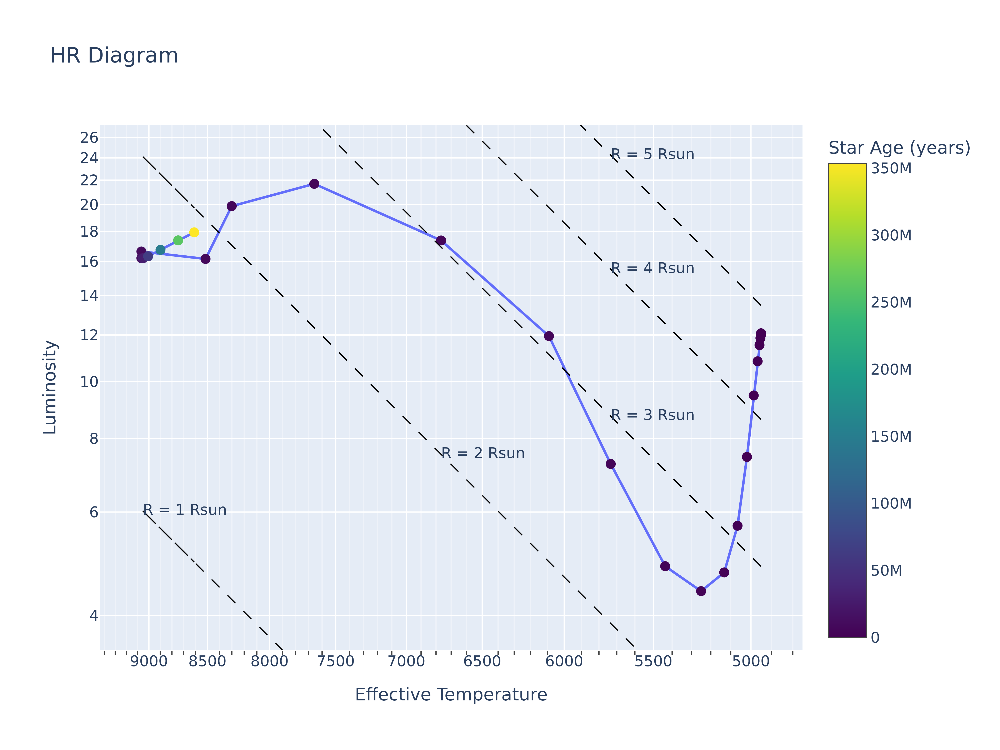
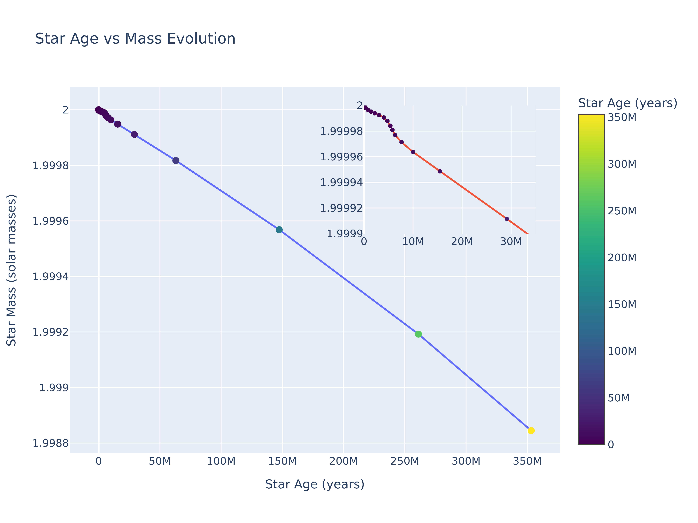
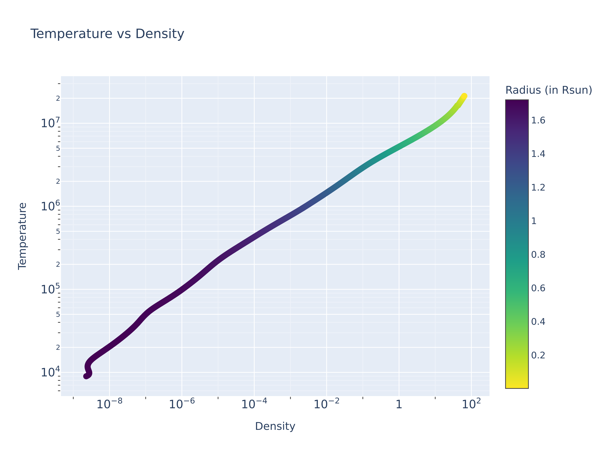

# MESA Star simulations and Results

- For P463/P763 course (Dr. Luke Chamandy)

## Introduction

This repository contains the MESA star simulations and results for the P463/P763 course. The simulations were done using the MESA stellar evolution code. The simulations were done for various parameters as required by the course. The results are presented in the form of plots.

## Assignment 2

The assignment 2 required the following simulations to be done:
```fortran
initial mass = 0.5 Msun
initial metallicity = 0.02
initial helium fraction = 0.28
stop_at_phase_He_Burn = .true.
cool_wind_RGB_scheme = 'Reimers'
Reimers_scaling_factor = 0.7d0
cool_wind_AGB_scheme = 'Blocker'
Blocker_scaling_factor = 0.15d0
```

<text style="color:red">The simulation failed for the above parameters failed (as discussed in the class). The simulation was done stop condition changed to:</text>
```fortran
max_age = 50.0d9
```

The simulation was done for the above parameters and the results are presented in the form of plots.

HR Diagram:

The constant contours of the HR diagram are also shown in the plot.

Evolution of mass with time:


Here, the inset shows the detailed plot of the initial evolution of the star.

Temperature vs Density profile over radius:


Written answers to the questions:

`2.b)`:
  Smaller (B-V) value indicates a bluer (hotter) star whereas a larger (B-V) value indicates a redder (cooler) star. Therefore, As Temperature increases, the (B-V) value decreases. The (B-V) value increases from left to right in the HR diagram given below.

  As Luminosity increases, the absolute magnitude decreases. Therefore, the absolute magnitude increases from top to bottom in the HR diagram given below.

  

`2.c)`: The spectral type of your star on the main sequence is F0.

`2.d)`, `2.e)`, `2.f)`: The answers are not relevant since the He burning condition had failed in simulations.


