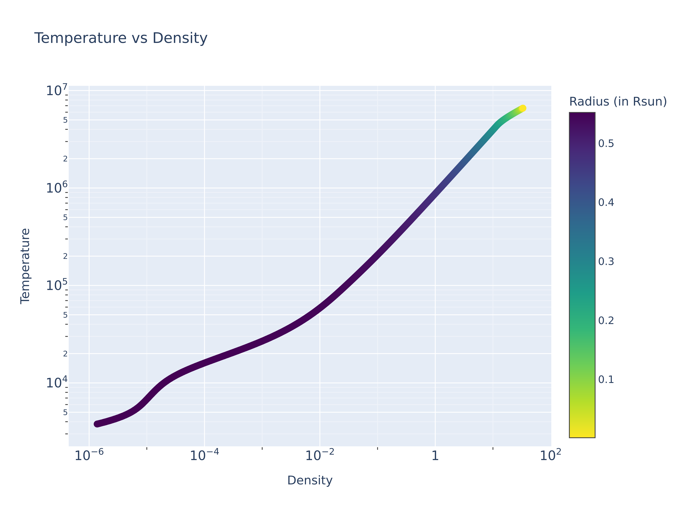
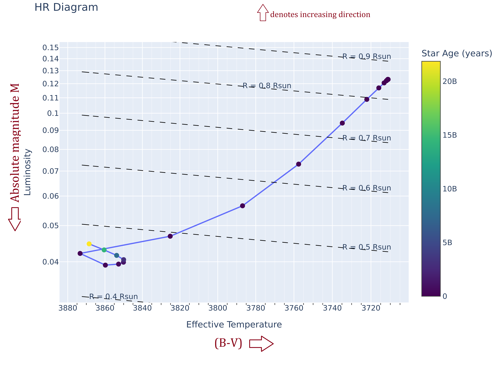

# MESA Star simulations and Results

- For P463/P763 course (Dr. Luke Chamandy)

## Introduction

This repository contains the MESA star simulations and results for the P463/P763 course. The simulations were done using the MESA stellar evolution code. The simulations were done for various parameters as required by the course. The results are presented in the form of plots.

## Table of Contents
- [MESA Star simulations and Results](#mesa-star-simulations-and-results)
  - [Introduction](#introduction)
  - [Table of Contents](#table-of-contents)
  - [Assignment 5](#assignment-5)
  - [Assignment 6](#assignment-6)
    - [a. $\\text{log}_{10}(\\rho)$ vs $\\text{log}_{10}(r/R)$ profile](#a-textlog10rho-vs-textlog10rr-profile)
    - [b. $\\text{log}_{10}(T)$ vs $\\text{log}_{10}(r/R)$ profile](#b-textlog10t-vs-textlog10rr-profile)
    - [c. Mass $m(r)$ vs $r/R$ profile](#c-mass-mr-vs-rr-profile)
    - [d. Luminosity $l(r)$ vs $r/R$ profile](#d-luminosity-lr-vs-rr-profile)
    - [e. Mass fractions X, Y, Z vs $r/R$ profile](#e-mass-fractions-x-y-z-vs-rr-profile)
    - [f. (P$\_\\text{rad}$)/P vs $r/R$ profile](#f-p_textradp-vs-rr-profile)
    - [g. ($\\nabla - \\nabla\_{ad}$) vs $r/R$ profile](#g-nabla---nabla_ad-vs-rr-profile)

## Assignment 5

The assignment 5 required the following simulations to be done:
```fortran
initial mass = 0.5 Msun
initial metallicity = 0.02
initial helium fraction = 0.28
stop_at_phase_He_Burn = .true.
cool_wind_RGB_scheme = 'Reimers'
Reimers_scaling_factor = 0.7d0
cool_wind_AGB_scheme = 'Blocker'
Blocker_scaling_factor = 0.15d0
```

<text style="color:red">The simulation failed for the above parameters failed (as discussed in the class). The simulation was done stop condition changed to:</text>

```fortran
max_age = 50.0d9
```

The simulation was done for the above parameters and the results are presented in the form of plots.

HR Diagram:

The constant contours of the HR diagram are also shown in the plot.

Evolution of mass with time:


Here, the inset shows the mass evolution in the initial years. THe mass was almost constant in the initial years.

Temperature vs Density profile over radius:


Written answers to the questions:

`2.b)`:
  Smaller (B-V) value indicates a bluer (hotter) star whereas a larger (B-V) value indicates a redder (cooler) star. Therefore, As Temperature increases, the (B-V) value decreases. The (B-V) value increases from left to right in the HR diagram given below.

  As Luminosity increases, the absolute magnitude decreases. Therefore, the absolute magnitude increases from top to bottom in the HR diagram given below.

  

`2.c)`: The spectral type of your star on the main sequence is F0.

`2.d)`, `2.e)`, `2.f)`: The answers are not relevant since the He burning condition had failed in simulations.

## Assignment 6

The assignment 6 requires the same simulations as assignment 5 but various profiles are to be plotted. The simulations were done for the following parameters:
```fortran
initial mass = 0.5 Msun
initial metallicity = 0.02
initial helium fraction = 0.28
stop_at_phase_He_Burn = .true.
cool_wind_RGB_scheme = 'Reimers'
Reimers_scaling_factor = 0.7d0
cool_wind_AGB_scheme = 'Blocker'
Blocker_scaling_factor = 0.15d0
```
As the mass of the star is 0.5 Msun, the star does not reach the He burning phase. Therefore, the simulation was done with an additional max_age condition:
```fortran
max_age = 2.0d10
```

Another important parameters to note in the plots are:
```python
Initial time: 1.00e-05 years
Final time: 2.00e+10 years

Initial radius: 8.49e-01 R_sun
Final radius: 4.69e-01 R_sun
```

Both the intial profile ($t = 1^{-5}$ years) and final profile ($t = 2^{10}$ years) are plotted for the following profiles:

### a. $\text{log}_{10}(\rho)$ vs $\text{log}_{10}(r/R)$ profile
   
  

  The density of the star increases at the core due to the nuclear reactions happening in the core. The increase in density reduces as we move towards the outer layers of the star. THe star has contracted as the radius has decreased from 0.849 R_sun to 0.469 R_sun. The overall increase is thus justified.

### b. $\text{log}_{10}(T)$ vs $\text{log}_{10}(r/R)$ profile
   
  

  Due to the nuclear reactions happening in the core, the temperature is maximum at the core. The temperature decreases as we move towards the outer layers of the star. The temperature does not vary much in the outer layers of the star, as seen in the covergence of the curves towards the surface.

### c. Mass $m(r)$ vs $r/R$ profile
   
  

  With Hydrogen burning happening in the core, the mass distribution shifts towards the core as the star contracts. This results in a overall increase in the mass function. As you can see the curves converge towards the core and surface as expected.
   The total mass of the star is 0.5 Msun and is conserved as per the convergence of the mass function towards surface.

### d. Luminosity $l(r)$ vs $r/R$ profile

  

  At the core where the nuclear reactions are happening, the luminosity is maximum. The luminosity decreases as we move towards the outer layers of the star. The luminosity is almost constant in the outer layers of the star.

### e. Mass fractions X, Y, Z vs $r/R$ profile

  
  As mentioned before, the star does not reach the He burning phase. Hence Z is constant throughout the star.The initial X and Y values are uniform throughout the star. 

  The Hydrogen mass fraction X decreases at the core (small r/R) as the hydrogen is consumed.
  The Helium mass fraction Y increases at the core as the hydrogen is consumed and helium is produced.

  The X and Y values are almost constant in the outer layers of the star as most of the nuclear reactions are happening in the core.

### f. (P$_\text{rad}$)/P vs $r/R$ profile

  

  As the the temperature in low-mass stars is not high enough to generate large amounts of radiation pressure, the radiation pressure is negligible compared to the gas pressure. The order of values of (P$_\text{rad}$/P) is very small (order of $10^{-4}$) as expected.

  <!-- The radiation pressure increases outside the core due to the radiation generated in the core. -->

### g. ($\nabla - \nabla_{ad}$) vs $r/R$ profile

  

  As expected the difference between the actual temperature gradient and the adiabatic temperature gradient is approximately zero in the radative zone and is stable against convection.

  The difference has a positive maximum near the surface indicating the convective zone.